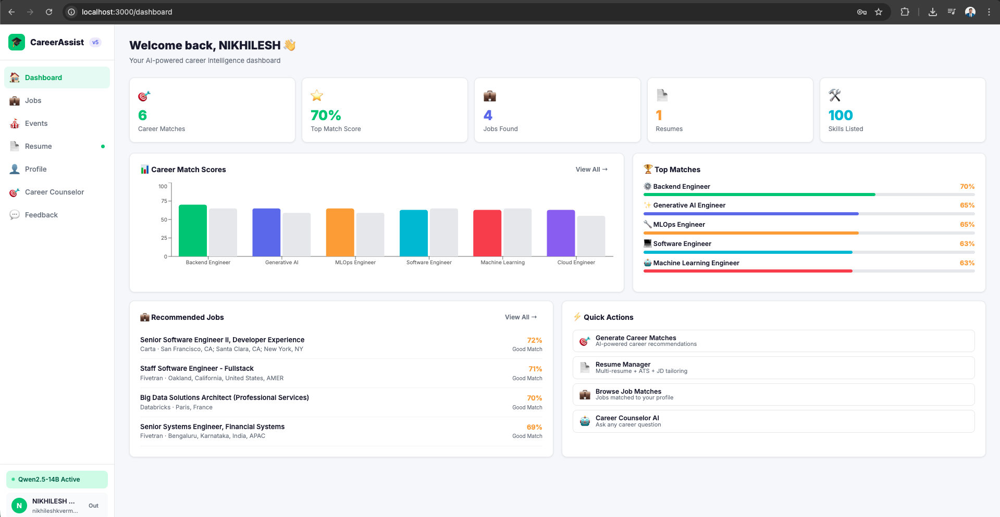
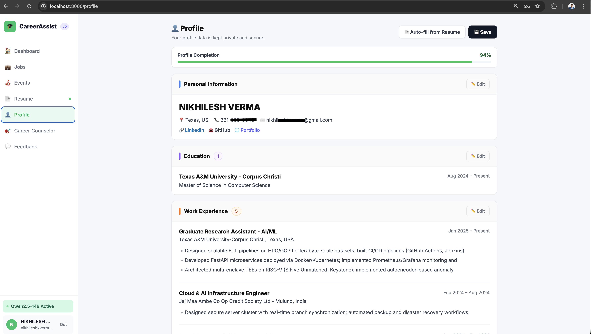
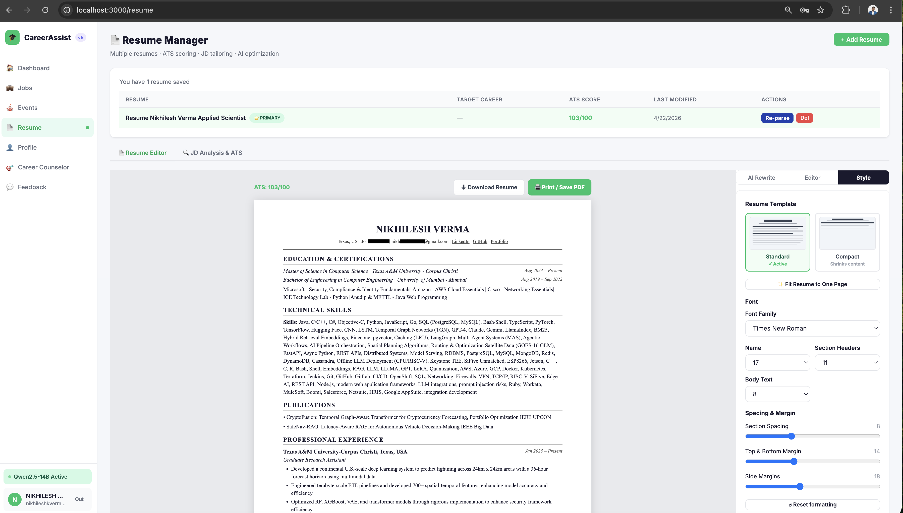
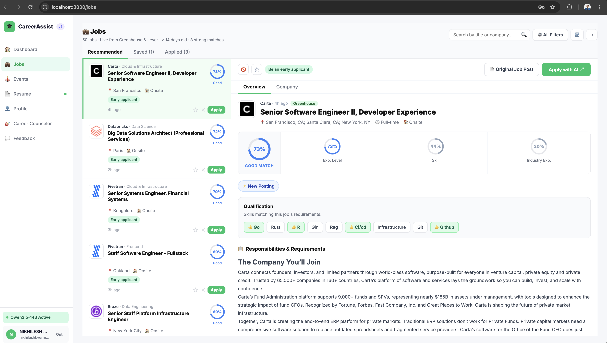
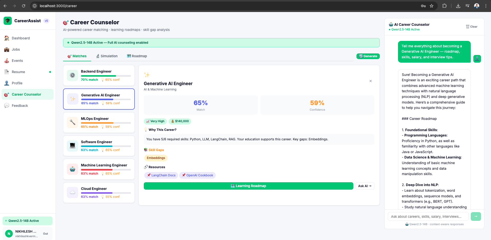
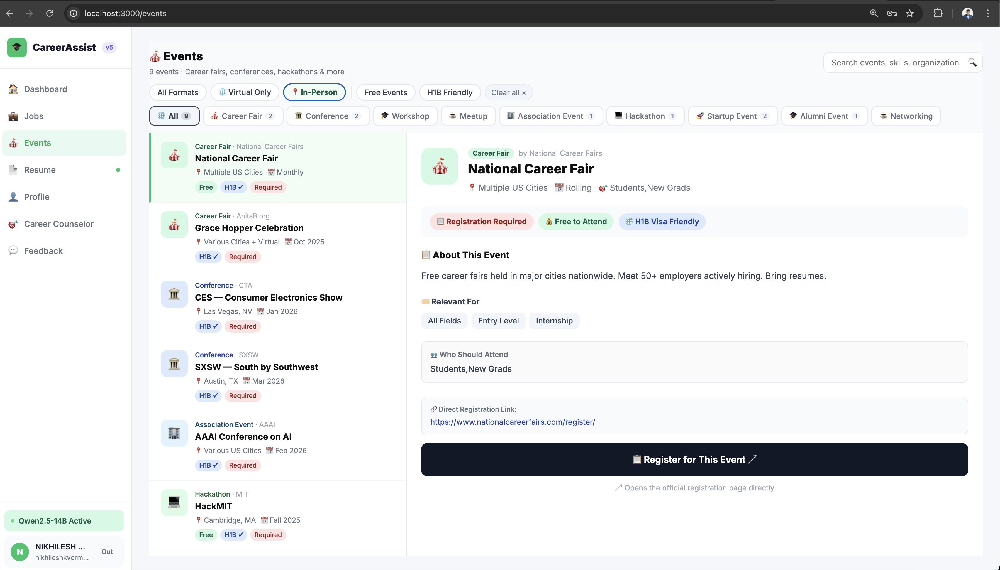
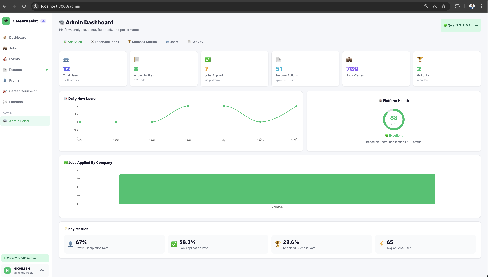
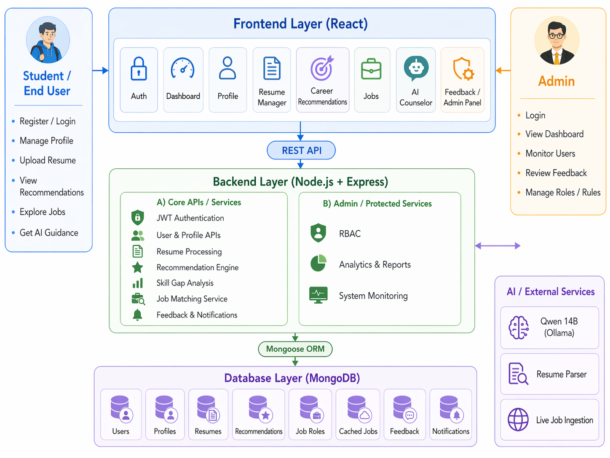

# 🚀 CareerAssist — AI-Assisted Career Guidance Platform

CareerAssist is a full-stack, AI-assisted career guidance platform designed to help students and job seekers move from career uncertainty to job readiness through one connected workflow.

Instead of using separate tools for career advice, resume improvement, skill planning, job discovery, and progress tracking, CareerAssist integrates all of these into a single platform.

--------------------------------------------------
🌟 HIGHLIGHTS
--------------------------------------------------

- 🎯 Explainable career recommendations with match percentages and confidence scores
- 🧩 Skill-gap analysis to identify missing competencies
- 📄 ATS-style resume scoring and job-description-based tailoring
- 🤖 AI Career Counselor powered locally through Qwen2.5-14B via Ollama
- 💼 Job recommendation, tracking, and live job ingestion support
- 📅 Events discovery for career and networking opportunities
- 🛡️ Admin governance, analytics, and platform monitoring

--------------------------------------------------
🧠 PROJECT OVERVIEW
--------------------------------------------------

CareerAssist was developed as part of Advanced Software Engineering (COSC 6370.001).

The project addresses a major problem in career development: students often rely on disconnected platforms for resumes, job search, skill improvement, and career guidance. This creates:

- poor career alignment
- weak resumes
- hidden skill gaps
- uninformed job application decisions

CareerAssist solves this by offering one integrated workflow where users can:

- create a structured career profile
- upload and analyze resumes
- receive explainable career recommendations
- identify skill gaps
- get AI-guided next steps
- explore matched job opportunities
- tailor resumes for target job descriptions
- track activity, feedback, and progress

--------------------------------------------------
📸 SCREENSHOTS
--------------------------------------------------

### 🏠 Dashboard

### 👤 Profile Management

### 📄 Resume Manager

### 💼 Job Recommendation Module

### 🤖 AI Career Counselor

### 📅 Events Module

### 🛡️ Admin Panel

### 🏗️ System Architecture

--------------------------------------------------
✨ CORE FEATURES
--------------------------------------------------

### 🔐 Authentication & Role-Based Access
- Secure JWT-based authentication
- Student and Admin roles
- Protected routes and admin-only access

### 👤 Career Profile Management
- Structured profile with skills, interests, education, experience, and goals
- Resume-based profile auto-fill support
- Centralized user data for recommendation and job matching

### 🎯 Explainable Career Recommendation
- Weighted skill-to-role matching
- Match percentage and confidence scoring
- Human-readable recommendation logic
- Career-specific guidance and roadmap suggestions

### 🧩 Skill Gap Analysis
- Missing skill detection for target roles
- Prioritized improvement recommendations
- Career simulation to show how new skills improve match scores

### 📄 Resume Intelligence
- Resume upload and parsing
- Multi-resume management
- ATS-style scoring
- Section completeness checks
- Keyword and skill alignment
- Job-description-based tailoring support

### 🤖 AI Career Counselor
- Personalized career guidance using profile and recommendation context
- Skill-based next-step suggestions
- Local AI inference through Qwen2.5-14B via Ollama

### 💼 Job Recommendation Module
- Personalized job matching based on user profile and skills
- Save / Apply / Dismiss workflow
- Search and refresh support
- Cached live job ingestion for performance and stability

### 📅 Events Module
- Curated career and networking opportunities
- Event filtering and discovery support

### 🛡️ Admin Governance
- Platform analytics and monitoring
- Feedback review
- User activity oversight
- Support for continuous platform improvement

--------------------------------------------------
🛠️ TECH STACK
--------------------------------------------------

Frontend
- React
- React Router
- Context API
- Custom CSS

Backend
- Node.js
- Express.js
- JWT Authentication
- Mongoose

Database
- MongoDB

AI / External Services
- Ollama
- Qwen2.5-14B
- Resume Parser
- Greenhouse
- Lever

--------------------------------------------------
🏗️ SYSTEM ARCHITECTURE
--------------------------------------------------

CareerAssist follows a modular layered architecture:

- Frontend Layer: React-based interface
- Backend Layer: Node.js + Express REST APIs
- Database Layer: MongoDB with Mongoose ORM
- AI / External Services: Ollama/Qwen model, resume parser, and job ingestion services

This architecture improves:

- maintainability
- modularity
- scalability
- separation of concerns

--------------------------------------------------
🔄 END-TO-END WORKFLOW
--------------------------------------------------

1. 🔑 User registers and logs in
2. 👤 User creates or updates a career profile
3. 📤 User uploads a resume
4. 📄 System parses and evaluates the resume
5. 🎯 Career recommendations and skill gaps are generated
6. 🤖 AI counselor provides guidance and next steps
7. 💼 Jobs are matched to the user profile
8. 📝 Resume is tailored to job descriptions
9. 📈 User tracks progress, applications, and feedback
10. 🛡️ Admin monitors users, activity, and platform health

--------------------------------------------------
⚙️ LOCAL SETUP
--------------------------------------------------

### 1. Start Ollama
ollama serve

### 2. Pull the model
ollama pull qwen2.5:14b

### 3. Start Backend
cd backend
npm install
node scripts/seed.js
npm run dev

### 4. Start Frontend
cd frontend
npm install
npm start

Default URLs
- Frontend: http://localhost:3000
- Backend: http://localhost:5001

--------------------------------------------------
🔐 DEMO ACCOUNTS
--------------------------------------------------

| Role    | Email                  | Password   |
|---------|------------------------|------------|
| Student | demo@student.com       | Demo@123   |
| Admin   | admin@careerassist.com | Admin@123  |

--------------------------------------------------
🧪 ENVIRONMENT VARIABLES
--------------------------------------------------

Create backend/.env and add:

PORT=5001
MONGODB_URI=mongodb://localhost:27017/careerassist_v10
JWT_SECRET=careerassist_v10_jwt_2026
OLLAMA_MODEL=qwen2.5:14b
OLLAMA_HOST=http://localhost:11434
AUTO_SETUP_OLLAMA=true
JOB_MATCH_THRESHOLD=70
JOB_CACHE_TTL_MINUTES=60
JOB_FETCH_LIMIT=100

--------------------------------------------------
💼 JOB DATA SUPPORT
--------------------------------------------------

CareerAssist does not rely on random Google scraping.

Instead, it uses structured job ingestion from supported ATS-style public job sources such as:

- Greenhouse
- Lever

The backend:
- fetches job postings
- normalizes them into a common format
- stores them in cache
- ranks them against the user profile

This makes job matching more stable, scalable, and explainable.

--------------------------------------------------
📁 SCREENSHOT FOLDER
--------------------------------------------------

Store screenshots in:

assets/screenshots/

Recommended screenshot file names:

- dashboard.png
- profile.png
- resume-manager.png
- jobs.png
- career-counselor.png
- events.png
- admin-panel.png
- architecture.png

Recommended screenshot order:

1. dashboard.png
2. profile.png
3. resume-manager.png
4. jobs.png
5. career-counselor.png
6. events.png
7. admin-panel.png
8. architecture.png

--------------------------------------------------
👥 TEAM
--------------------------------------------------

SmartPath Innovators

- Keerthana Ellanki
- Chandana Lingala
- Keerthi Reddy Vangeti
- Nikhilesh Verma

--------------------------------------------------
🎓 ACADEMIC CONTEXT
--------------------------------------------------

This project was developed for Advanced Software Engineering (COSC 6370.001) and demonstrates:

- full-stack development
- modular software architecture
- role-based access control
- resume intelligence
- explainable recommendation logic
- integrated career decision-support workflows

--------------------------------------------------
📌 FINAL NOTE
--------------------------------------------------

CareerAssist transforms fragmented career guidance into an integrated, explainable, and actionable decision-support platform for students and job seekers.

--------------------------------------------------
📜 LICENSE
--------------------------------------------------

© 2026 SmartPath Innovators. All rights reserved.

This project is shared for academic and demonstration purposes only.
Unauthorized copying, modification, distribution, or commercial use is not permitted.
